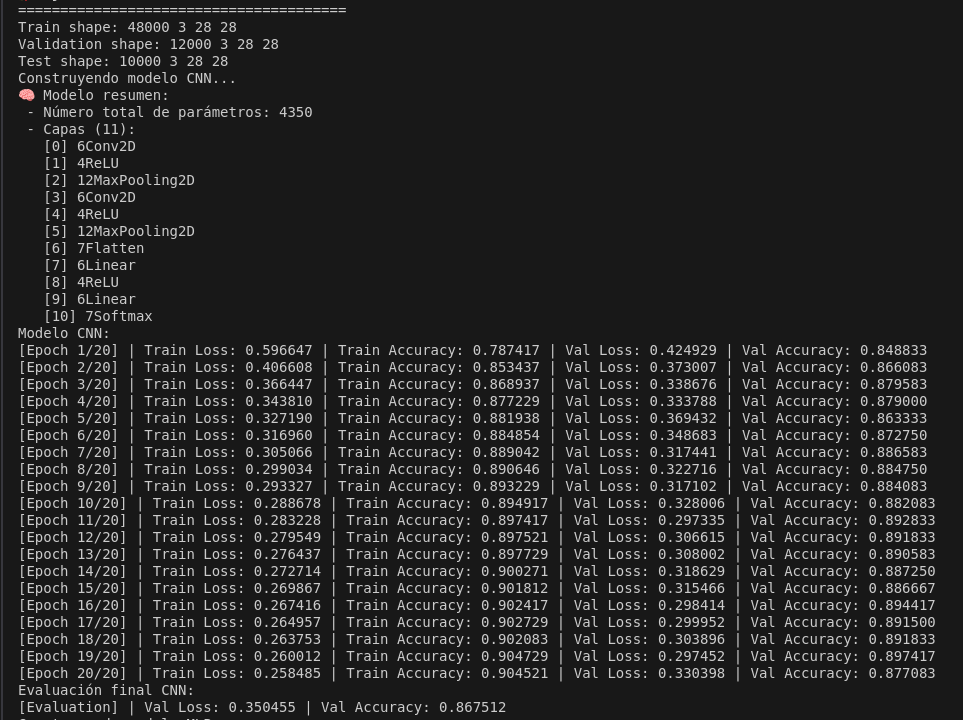
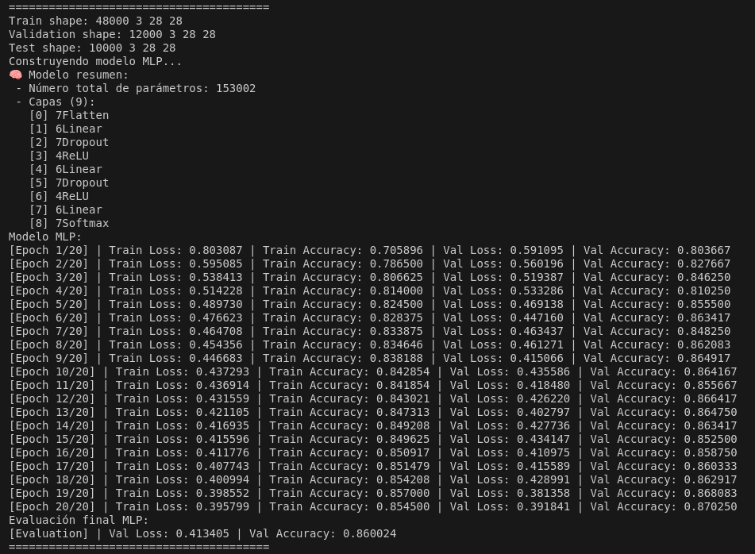
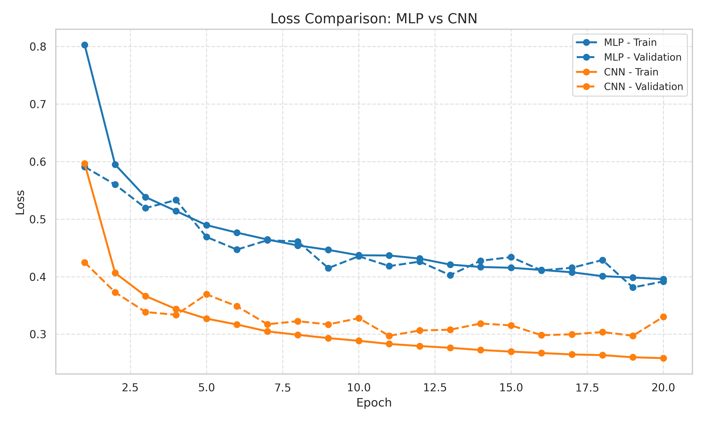
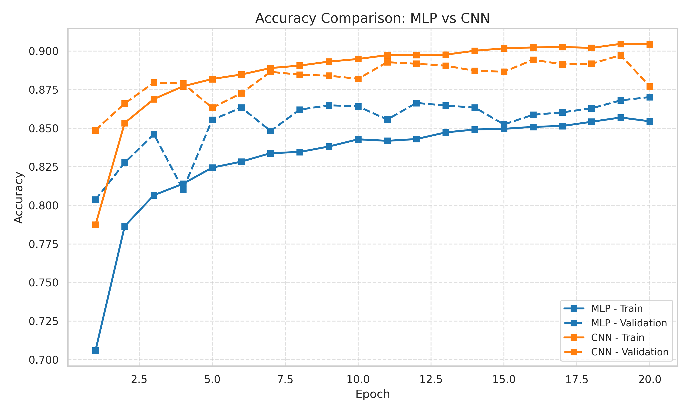

# Comparación de MLP y CNN para Clasificación de Imágenes en Fashion-MNIST

Este proyecto compara el desempeño de dos arquitecturas de redes neuronales —un Perceptrón Multicapa (MLP) y una Red Neuronal Convolucional (CNN)— en la tarea de clasificación de imágenes del conjunto **Fashion‑MNIST**, implementadas desde cero en **C++**.

## 📚 Descripción

El objetivo principal es evaluar cuál arquitectura logra mejores resultados en términos de precisión y pérdida, bajo condiciones de entrenamiento equivalentes. Para ello se desarrollaron, entrenaron y evaluaron ambas redes utilizando una infraestructura personalizada basada en `Tensor`, `Conv2D`, `Dense`, `Flatten`, etc.


---


## Compilación y Ejecución

El proyecto utiliza CMake para la compilación y un script `run.sh` que facilita las tareas comunes:

### Otorgar permisos al script (solo la primera vez):

```bash
chmod +x run.sh
````

### Comandos disponibles en el script

```bash
./run.sh build    # Construye el proyecto con CMake y Make
./run.sh test     # Ejecuta las pruebas unitarias
./run.sh main     # Ejecuta el programa principal 
```

El script crea un directorio `build/`, genera los archivos de construcción con CMake y compila usando todos los núcleos disponibles.


## 🧠 Modelos Implementados

### 🔹 MLP (Multilayer Perceptron)
- 2 capas ocultas densas: 64 y 32 neuronas.
- Función de activación: ReLU.
- Regularización: Dropout.
- Salida: Softmax con 10 clases.

### 🔹 CNN (Convolutional Neural Network)
- 2 bloques convolucionales con filtros $3\times3$ y padding conservador.
- MaxPooling $2\times2$ tras cada bloque.
- Aplanamiento (Flatten).
- 2 capas densas finales, incluida la capa de salida softmax.

## 🧪 Dataset

Se utilizó el conjunto [Fashion-MNIST](https://github.com/zalandoresearch/fashion-mnist):
- 60,000 imágenes para entrenamiento.
- 10,000 imágenes para prueba.
- Imágenes de $28\times28$ píxeles en escala de grises (convertidas a 3 canales RGB para compatibilidad).

## ⚙️ Entrenamiento

- Optimizador: **Stochastic Gradient Descent (SGD)**
- Learning rate: `0.002`
- Épocas: `20`
- Batch size: `32`
- Función de pérdida: Entropía cruzada categórica

## 📈 Resultados

Durante el entrenamiento se registraron métricas por época (pérdida y precisión en entrenamiento y validación). La siguiente tabla resume el **desempeño final en el conjunto de prueba**:

| Modelo | Precisión en test | Pérdida en test |
|--------|-------------------|-----------------|
| CNN    | 0.8675            | 0.3505          |
| MLP    | 0.8600            | 0.4134          |

> La CNN superó ligeramente al MLP en todos los aspectos, confirmando su eficacia para extraer características espaciales en imágenes.

## 🖼️ Visualizaciones
### 🔹 Capturas de consola del entrenamiento

CNN:


MLP:


### 🔹 Curvas de entrenamiento

**Evolución de la pérdida (`loss`)**


**Evolución de la precisión (`accuracy`)**



## 📁 Estructura del Código

El código fuente está disponible en el apéndice del informe y se encuentra estructurado en módulos como:

```
├── CMakeLists.txt
├── data
│   ├── fashionmnist
│   │   ├── t10k-images-idx3-ubyte
│   │   ├── t10k-labels-idx1-ubyte
│   │   ├── train-images-idx3-ubyte
│   │   └── train-labels-idx1-ubyte
│   ├── mnist45
│   ├── t10k-images.idx3-ubyte
│   ├── t10k-labels.idx1-ubyte
│   ├── train-images.idx3-ubyte
│   └── train-labels.idx1-ubyte
├── examples
│   ├── accuracy_comparison.png
│   ├── cnn2.png
│   ├── cnn.cpp
│   ├── loss_comparison.png
│   ├── mainas.cpp
│   ├── main.py
│   ├── mlp.png
│   ├── mnist_cnn.cpp
│   └── sequence_rnn.cpp
├── include
│   ├── activations
│   │   ├── Activation.hpp
│   │   ├── ReLU.hpp
│   │   ├── Sigmoid.hpp
│   │   ├── Softmax.hpp
│   │   └── Tanh.hpp
│   ├── core
│   │   ├── Initializer.hpp
│   │   ├── Layer.hpp
│   │   ├── Loss.hpp
│   │   ├── Model.hpp
│   │   └── Tensor.hpp
│   ├── layers
│   │   ├── AveragePooling2D.hpp
│   │   ├── Conv2D.hpp
│   │   ├── Dropout.hpp
│   │   ├── Flatten.hpp
│   │   ├── Linear.hpp
│   │   ├── MaxPooling2D.hpp
│   │   ├── MinPooling2D.hpp
│   │   └── RNN.hpp
│   ├── metrics
│   │   └── Metric.hpp
│   ├── models
│   │   └── models.hpp
│   ├── NeuralNet.hpp
│   ├── optimizers
│   │   ├── Adam.hpp
│   │   ├── Optimizer.hpp
│   │   ├── RMSProp.hpp
│   │   └── SGD.hpp
│   └── utils
│       ├── DatasetLoader.hpp
│       ├── DataUtils.hpp
│       └── Logger.hpp
├── README.md
├── run.sh
├── src
│   └── main.cpp
├── training_log_cnn.csv
└── training_log_mlp.csv

```

## 🧩 Dependencias

Este proyecto está escrito en **C++17**, y no requiere frameworks externos como TensorFlow o PyTorch.

## ✅ Conclusiones

La CNN ofrece mejor rendimiento que el MLP bajo el mismo esquema de entrenamiento. Para futuros trabajos se recomienda:
- Incorporar técnicas como **Batch Normalization**.
- Utilizar arquitecturas más profundas (e.g., ResNet).
- Aplicar técnicas de data augmentation.

## 📄 Licencia

Este proyecto se publica con fines educativos y académicos. Puedes reutilizar el código citando al autor original.

---

